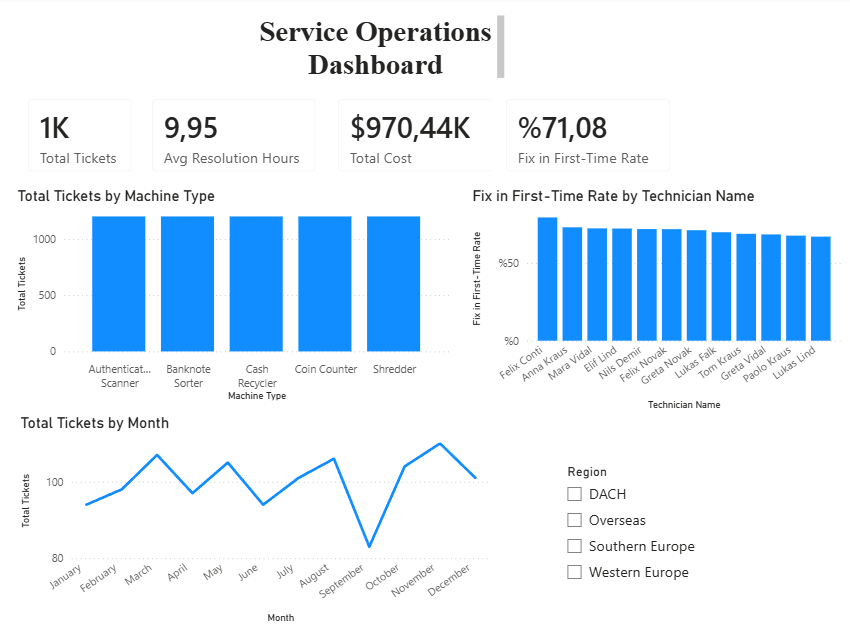

# Service Operations Analytics Dashboard — Power BI

An end-to-end Power BI project analysing service and repair operations for
cash-handling and currency-technology equipment (banknote sorters, coin
counters, cash recyclers, authentication scanners). The report tracks ticket
volume, resolution time, service cost, and first-time-fix performance across
machines, technicians, customers, and time.

> Built as a self-directed learning project to practise the full Power BI
> workflow: data preparation, dimensional modelling (star schema), DAX
> measures, and interactive reporting.

---

## Dashboard Preview



**Key KPIs:** Total Tickets · Avg Resolution Hours · Total Cost · First-Time-Fix %

---

## Data Model (Star Schema)

The model follows a classic **star schema**: one central **fact table**
surrounded by **dimension tables**, connected by one-to-many relationships.

```
              customers
                  |
 technicians --- service_tickets --- machines
                  |
               dim_date
```

| Table             | Type      | Grain / Description                                  |
|-------------------|-----------|------------------------------------------------------|
| `service_tickets` | Fact      | One row per service/repair event (1,200 rows)        |
| `machines`        | Dimension | One row per machine (type, model, install year)      |
| `technicians`     | Dimension | One row per technician (team, seniority)             |
| `customers`       | Dimension | One row per customer (region, contract tier)         |
| `dim_date`        | Dimension | One row per calendar day of 2024                     |

**Relationships** (all one-to-many, from dimension → fact):
- `machines[machine_id]` → `service_tickets[machine_id]`
- `technicians[technician_id]` → `service_tickets[technician_id]`
- `customers[customer_id]` → `service_tickets[customer_id]`
- `dim_date[date]` → `service_tickets[date]`

Because the fact table is connected to every dimension, a single slicer
(e.g. Region) filters all visuals at once across all tables.

---

## DAX Measures

```DAX
Total Tickets = COUNTROWS(service_tickets)

Avg Resolution Hours = AVERAGE(service_tickets[resolution_hours])

Total Cost = SUM(service_tickets[cost_eur])

First Time Fix % =
DIVIDE(
    CALCULATE(
        COUNTROWS(service_tickets),
        service_tickets[first_time_fix] = "Yes"
    ),
    COUNTROWS(service_tickets)
)
```

`First Time Fix %` uses `CALCULATE` to count only first-time-fix tickets and
`DIVIDE` to compute the ratio safely (DIVIDE returns blank instead of an error
on division by zero).

---

## Data Preparation (Power Query)

Cleaning steps applied to `service_tickets`:
- **Standardised casing** in `first_time_fix` (values arrived as a mix of
  `Yes` / `yes`) so the value matched the DAX filter.
- **Handled missing values** in `issue_type`: ~1% of rows were blank. Rather
  than deleting otherwise-valid rows or imputing a fake category, blanks were
  replaced with `"Unknown"` — preserving the records while keeping the gap
  transparent in the report.
- Reviewed every column with **Column Quality** and **Column Distribution** to
  confirm data types and check error/empty rates before loading.

---

## Example SQL

If the data lived in a relational database instead of CSV files, these are the
kinds of queries that would feed the report:

```sql
-- Ticket volume and average resolution time by machine type
SELECT m.machine_type,
       COUNT(*)                  AS total_tickets,
       AVG(t.resolution_hours)   AS avg_resolution_hours
FROM   service_tickets t
JOIN   machines m ON t.machine_id = m.machine_id
GROUP  BY m.machine_type
ORDER  BY total_tickets DESC;

-- First-time-fix rate by technician team
SELECT te.team,
       AVG(CASE WHEN t.first_time_fix = 'Yes' THEN 1.0 ELSE 0 END) AS first_time_fix_rate
FROM   service_tickets t
JOIN   technicians te ON t.technician_id = te.technician_id
GROUP  BY te.team;

-- Monthly service cost
SELECT d.month_name,
       SUM(t.cost_eur) AS total_cost
FROM   service_tickets t
JOIN   dim_date d ON t.date = d.date
GROUP  BY d.month_name, d.month_number
ORDER  BY d.month_number;
```

---

## Tools & Skills Demonstrated

- **Power BI Desktop** — report building, interactive slicers, KPI cards
- **Data modelling** — star schema, one-to-many relationships
- **Power Query (M)** — data cleaning, type handling, missing-value treatment
- **DAX** — aggregations, `CALCULATE`, `DIVIDE`, filter context
- **SQL** — joins and aggregations (see examples above)
- **Sort-by-column** — sorting month names in calendar order, not alphabetically

---

## Files in This Repo

| File                          | Description                          |
|-------------------------------|--------------------------------------|
| `Service_Operations.pbix`     | Power BI report file                 |
| `dashboard.png`               | Screenshot of the final dashboard    |
| `data/service_tickets.csv`    | Fact table                           |
| `data/machines.csv`           | Machine dimension                    |
| `data/technicians.csv`        | Technician dimension                 |
| `data/customers.csv`          | Customer dimension                   |
| `data/dim_date.csv`           | Date dimension                       |

---

## Notes

The dataset is **synthetic**, generated for learning purposes; it does not
represent any real company or customer. The scenario was chosen to mirror a
service-operations analytics context.
